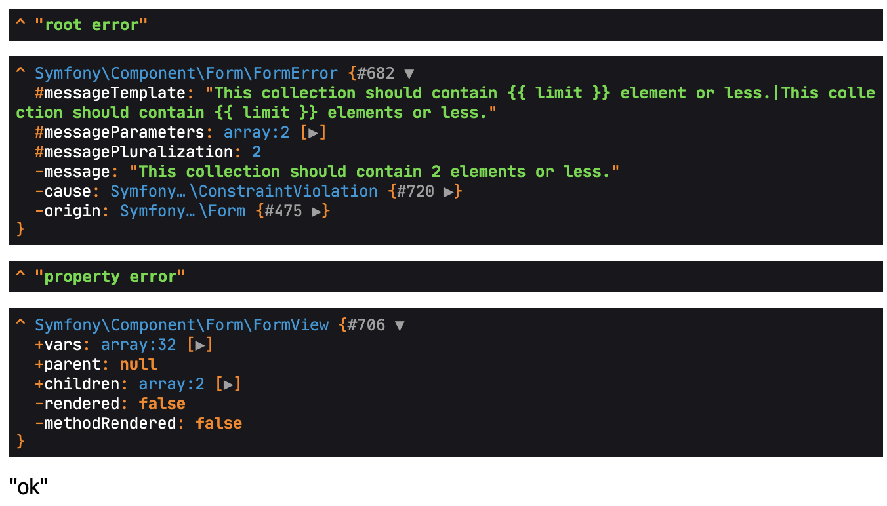

# Reproducer

## Start

```
composer install
docker-composer up -D
symfony serve
```

## Prepare

Open `https://localhost:8000/prepare` to create the category items.

## Test

Open `https://localhost:8000/test`

## Summary

In the [ItemController](./src/Controller/ItemController.php) you can see that only the root errors will be read with `$errors = $form->getErrors(false, false);`.

- The `cause` property looks correct and is set to `data.itemCategories`
- The root form errors contains the error which I would say is wrong
- The property errors does not contain the error which I would say is wrong


